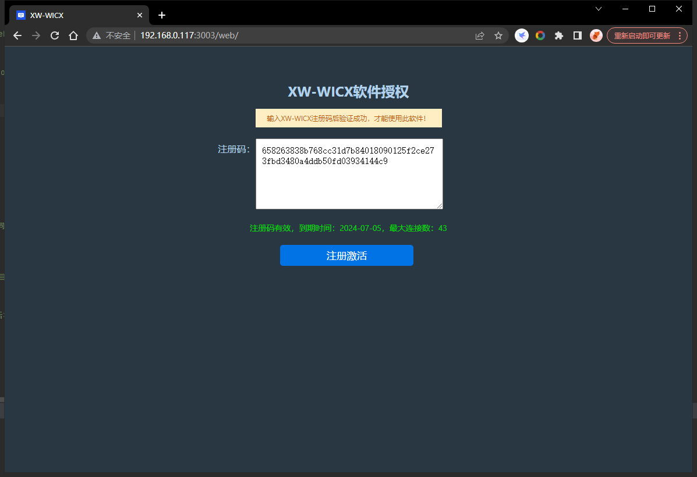
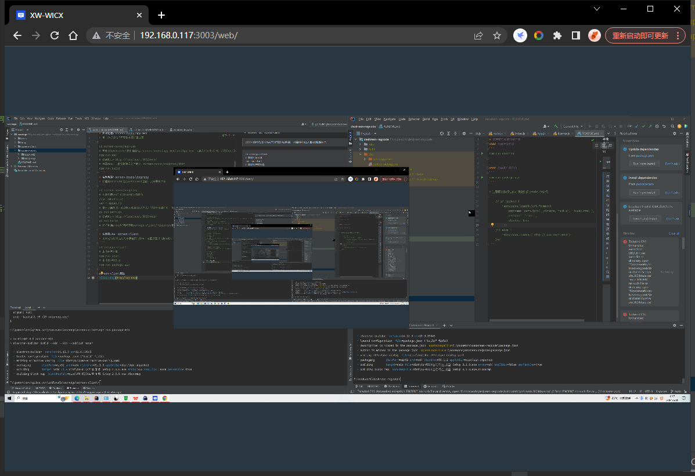
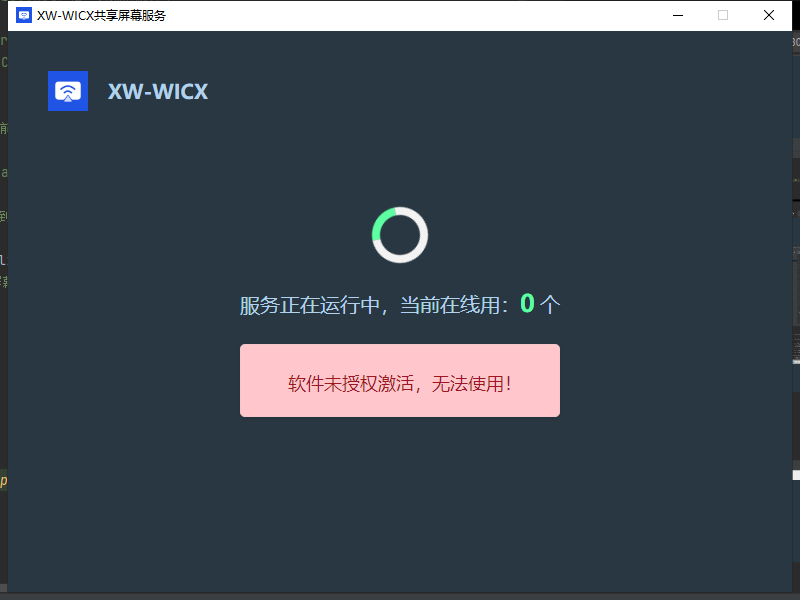
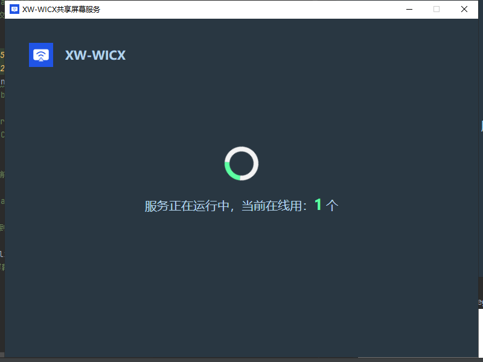
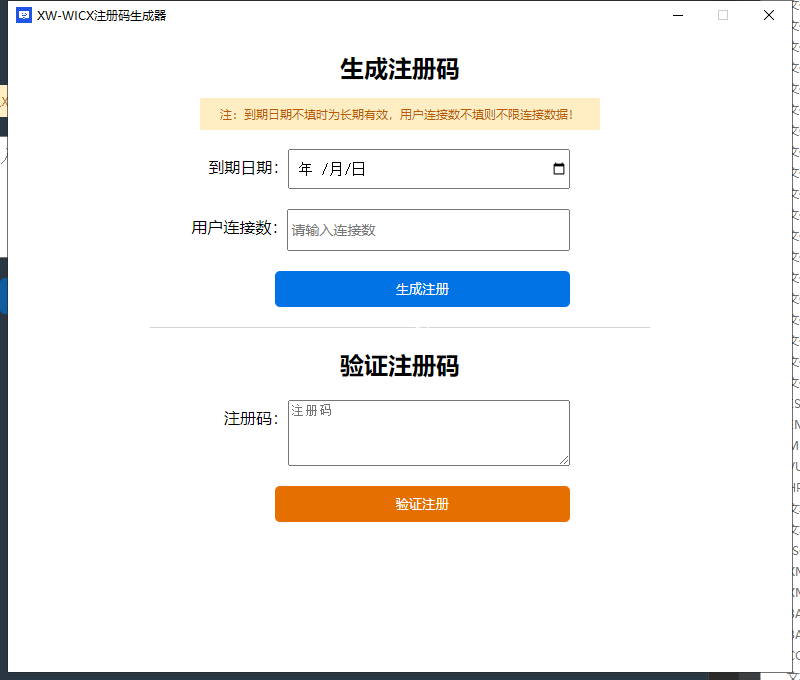
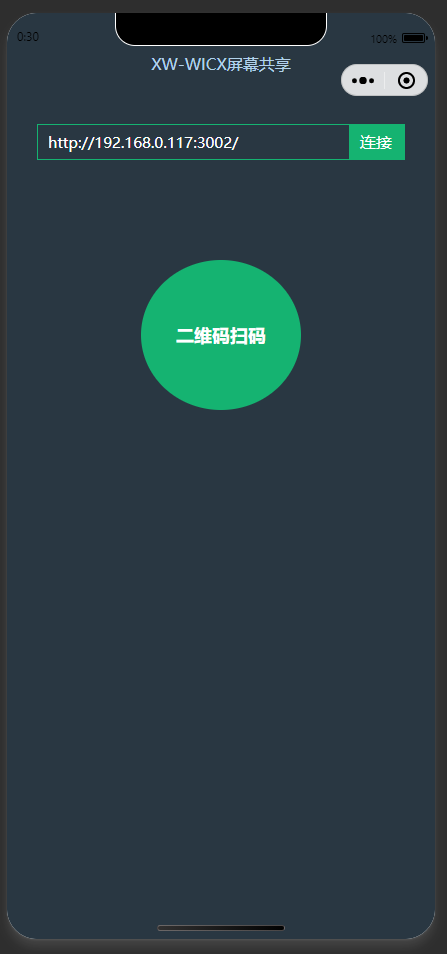

# 会议室多屏共享屏幕程序
> 开始使用：[安装手册](docs/安装手册.docx)
## 1、安装VNC
`novnc-go\vncproxy\UltraVNC_1_3_60_X64_Setup.exe`

## 2、开发启动
* 启动前端：screen-novnc/app-web
> 用于浏览器访问可查看共享屏幕画面
````
cd screen-novnc/app-web
# 需要修改websocket的代理路径，screen-novnc/app-web/src/App.tsx，切换为：url={`ws://${host}/socket/ws`} // vite 运行测试，可以改为环境变量自动切换
npm run dev
# 访问地址：http://localhost:3002/web/
# 编译web，会直接将编译文件放到：screen-novnc/vncproxy/dist
npm run build
````


* 启动后端：screen-novnc/vncproxy
> 代理与UltraVNC进行Websocket通信，实现屏幕共享
````
cd screen-novnc/vncproxy
# 启动代理vnc与UltraVNC进行通信
//go:embed dist  
var f embed.FS
# 基于上面方式，通过嵌入前端dist方式，仅运行后端即可一同访问前端
go run main.go
# 访问地址：http://localhost:3003/web/
go run build
# 将打包后的exe程序拷贝到screego-client/resources目录下
````
* 启动客户端：screen-client
> 用于可视化UI运行共享屏幕的服务端，可监控在线人数及激活状态
````
cd screego-client
# 本地开发环境
npm run start
# 本地客户端打包
npm run package-win
````
screen-client截图



* 启动注册码生成客户端：screen-regcode
> 用于共享服务激活码生成
````
# 本地开发环境
npm run electron
#本地客户端打包 
npm run package-win 
````


* APP或平板访问共享屏幕

